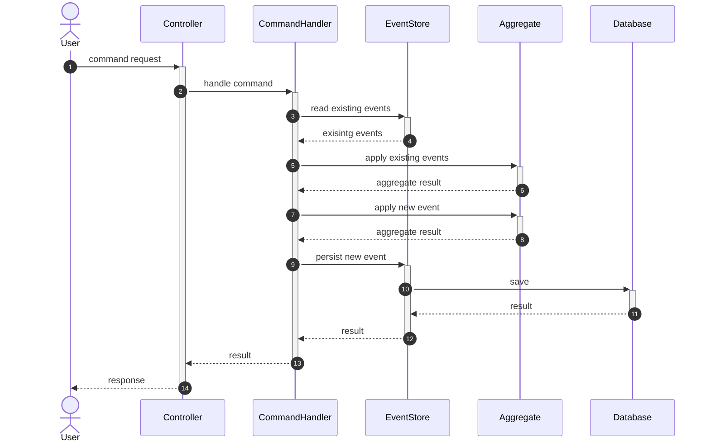
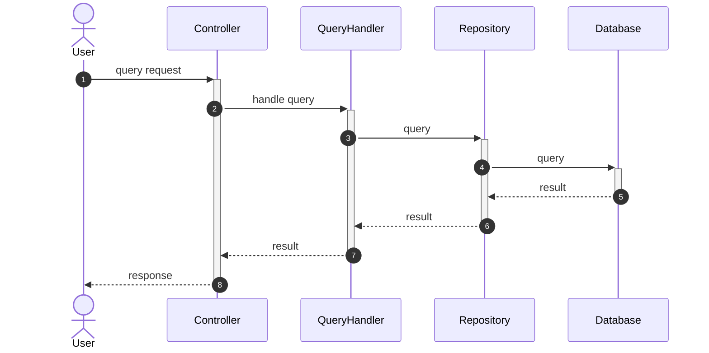

# event-sourcing
🚧 **This library is under construction!** 🚧

[](https://github.com/benjaminjacobberg/event-sourcing/actions/workflows/rust.yml)
[](https://github.com/benjaminjacobberg/event-sourcing/blob/main/LICENSE)


<!-- TOC -->
* [event-sourcing](#event-sourcing)
  * [Summary](#summary)
  * [Guide](#guide)
    * [Prerequisites](#prerequisites)
    * [Dependencies](#dependencies)
    * [Events](#events)
      * [Implementation Example](#implementation-example)
    * [Aggregates](#aggregates)
      * [Implementation Example](#implementation-example-1)
    * [Commands](#commands)
      * [Implementation Example](#implementation-example-2)
    * [Command Handlers](#command-handlers)
      * [Snapshots](#snapshots)
      * [Implementation Example](#implementation-example-3)
  * [Diagrams](#diagrams)
    * [Sequence Diagrams](#sequence-diagrams)
      * [Execute Command](#execute-command)
      * [Query State](#query-state)
<!-- TOC -->

## Summary

Library containing the building blocks to construct a distributed event sourced application.

## Guide

ℹ️ - An example project [Bank Account](./examples/bankaccount) is available to view how to implement this library.

### Prerequisites

- ScyllaDB
- Apache Kafka
- Kafka Connect 
  - Install connector: [scylla-cdc-source-connector](https://github.com/scylladb/scylla-cdc-source-connector)

### Dependencies

Add the following dependencies to your `Cargo.toml`:
```toml
[dependencies]
event-sourcing = { git = "https://github.com/benjaminjacobberg/event-sourcing" }
event-store-scylladb = { git = "https://github.com/benjaminjacobberg/event-sourcing" }
event-bus-kafka = { git = "https://github.com/benjaminjacobberg/event-sourcing" }
```

### Events

An event represents a fact that took place in the domain. They are the source of truth; your current state is derived 
from the events. They are immutable, and represent the business facts.

####  Implementation Example

```rust
#[derive(Debug, Clone, serde::Serialize, serde::Deserialize, PartialEq)]
pub enum BankAccountEvents {
    AccountOpened { account_id: String, name: String },
}

impl Event for BankAccountEvents {
    fn event_type(&self) -> String {
        match &self {
            BankAccountEvents::AccountOpened { .. } => String::from("AccountOpened"),
        }
    }

    fn revision(&self) -> i64 {
        match &self {
            BankAccountEvents::AccountOpened { .. } => 1,
        }
    }
}

```

### Aggregates

An aggregate is a cluster of associated objects that we treat as a unit for the purpose of data changes.

####  Implementation Example

```rust
#[derive(Debug, Clone, serde::Serialize, serde::Deserialize)]
pub struct BankAccount {
  pub name: String,
  pub account_id: String,
  pub balance: i128,
}

impl Aggregate for BankAccount {
    type AggregateID = String;
    type Event = BankAccountEvents;
    type Error = Error;

    fn aggregate_id(&self) -> &Self::AggregateID {
        &self.account_id
    }

    fn aggregate_type(&self) -> String {
        String::from("BankAccount")
    }

    fn apply(state: Option<Self>, event: Self::Event) -> Result<Self, Self::Error> {
      todo!("Validate the event and update the struct fields");
    }

    fn apply_all(state: Option<Self>, events: Vec<Self::Event>) -> Result<Self, Self::Error> {
        match events.into_iter().fold(Ok(state), |state, event| {
            Self::apply(state?, event).map(|new_state| Some(new_state))
        }) {
            Ok(Some(state)) => Ok(state),
            Ok(None) => Err(Error::from("Aggregate must not be None")),
            Err(error) => Err(error),
        }
    }
}
```

### Commands

TODO

####  Implementation Example

```rust
pub(crate) struct OpenAccountCommand {
    pub name: String,
}

impl Command for OpenAccountCommand {
    fn target_aggregate_identifier(&self) -> Option<&String> {
        None // Not present during creation of the aggregate.
    }
}
```

### Command Handlers

TODO

#### Snapshots

For instances where you have a large series of events for a particular aggregate, it can be inefficient to retrieve all
the events. Instead, we could retrieve a snapshot and use it for our business logic.

- Get the latest snapshot: `let optional_snapshot_envelope = self.snapshot_store.read(aggregate_id).await?;`
- Save the latest snapshot: `self.snapshot_store.persist(snapshot_envelope).await?;`

####  Implementation Example

```rust
pub(crate) struct OpenAccountCommandHandler<E>
  where
          E: EventStore<BankAccountEvents>,
{
  pub event_store: E,
}

#[async_trait::async_trait]
impl<E: EventStore<BankAccountEvents>> CommandHandler<OpenAccountCommand>
for OpenAccountCommandHandler<E>
{
  type Error = Error;

  async fn handle(&self, command: OpenAccountCommand) -> Result<CommandResponse, Self::Error> {
    let open_account_event = AccountOpened {
      account_id: Uuid::new_v4().to_string(),
      name: command.name,
    };
    let bank_account: BankAccount = BankAccount::apply(None, open_account_event.clone())?;
    let sequence = next_sequence::<BankAccountEvents, BankAccount>(vec![], None);
    let event_envelope: &EventEnvelope<BankAccountEvents> = &EventEnvelope::new(
      bank_account.aggregate_id().to_string(), // ID of the aggregate that the envelope belongs to.
      bank_account.aggregate_type(), // Type of the aggregate that the envelope can be applied to.
      open_account_event.clone(), // Event attached to the envelope.
      open_account_event.event_type().to_string(), // Type of the envelope.
      Utc::now(),              // Timestamp of when the event was created.
      sequence,                // Location in a sequence of events.
      open_account_event.revision(), // Revision of the event.
      HashMap::from([
        (String::from("trace-id"), Uuid::new_v4().to_string()),
        (String::from("correlation-id"), String::from("")),
      ]),
    );
    self.event_store.persist(event_envelope).await?;

    Ok(CommandResponse {
      aggregate_id: bank_account.aggregate_id().to_string(),
      sequence,
    })
  }
}
```

## Diagrams

### Sequence Diagrams

#### Execute Command



#### Query State

